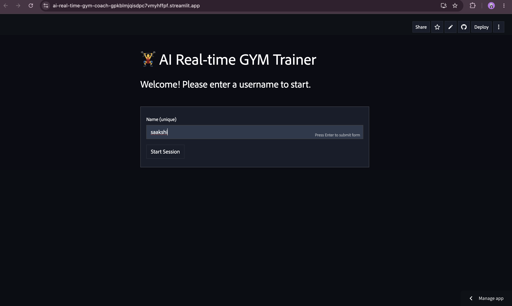
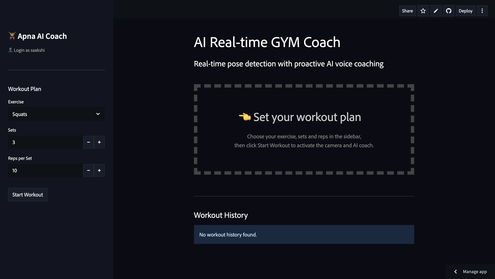
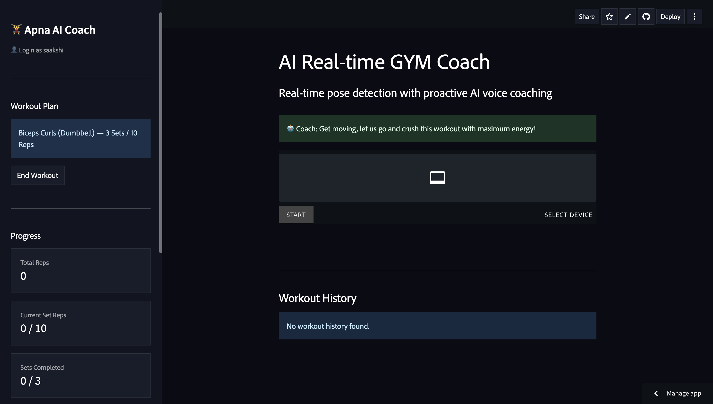
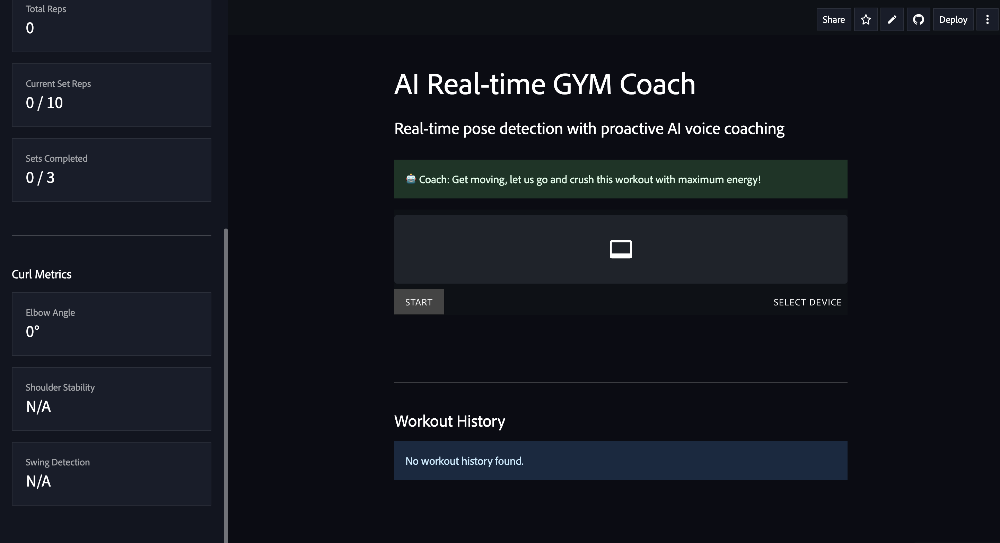

# 🏋️‍♂️ AI Real-time GYM Coach

A real-time AI-powered fitness coaching application built with Streamlit and MediaPipe. It uses live webcam feed to detect body pose, count exercise repetitions, analyze form, and deliver proactive voice feedback via a Groq-powered LLM.

**Live Demo:** [ai-real-time-gym-coach.streamlit.app](https://ai-real-time-gym-coach-gpkblmjqisdpc7vmyhffpf.streamlit.app)

---

## Features

- **Real-time Pose Detection** — MediaPipe PoseLandmarker tracks 33 body landmarks at video speed via WebRTC
- **Exercise Recognition** — Supports Squats, Push-ups, Biceps Curls, Shoulder Press, and Lunges
- **Rep & Set Counting** — Automatic repetition detection with configurable sets and reps per set
- **Form Analysis** — Per-exercise biomechanical checks (depth, alignment, back arch, swing, balance)
- **AI Voice Coaching** — Groq LLM generates contextual feedback; gTTS converts it to audio played in-browser
- **Workout History** — SQLite-backed persistence; per-user history aggregated by exercise and date
- **User Authentication** — Simple login wall with session-based access control

---

## Tech Stack

| Layer | Technology |
|---|---|
| Frontend / UI | Streamlit 1.45.0 |
| Video Streaming | streamlit-webrtc 0.47.1 + aiortc |
| Pose Estimation | MediaPipe 0.10.14 PoseLandmarker |
| Computer Vision | OpenCV (opencv-contrib-python-headless) |
| LLM Coaching | Groq API (llama3 / mixtral) |
| Text-to-Speech | gTTS |
| Database | SQLite via Python `sqlite3` |
| Language | Python 3.11 |

---

## Project Structure

```
AI-Real-time-GYM-Coach/
├── main.py                        # Streamlit entry point
├── requirements.txt
├── packages.txt                   # System-level apt dependencies
├── .streamlit/
│   └── config.toml
├── detectors/                     # Per-exercise rep & form detectors
│   ├── squat.py
│   ├── pushup.py
│   ├── biceps_curl.py
│   ├── shoulder_press.py
│   └── lunges.py
├── services/
│   ├── auth/                      # Login wall
│   ├── coaching/                  # LLM, TTS, voice pipeline
│   ├── config/                    # Exercise options, pose connections
│   ├── persistence/               # SQLite repository
│   ├── state/                     # Session state defaults
│   ├── tracking/                  # Metrics sync
│   ├── ui/                        # CSS loader, font injection
│   └── vision/                    # VideoProcessorClass (WebRTC frame handler)
├── ml_models/
│   └── pose_landmarker_full.task  # MediaPipe model file
└── static/
    └── style.css
```

---

## Local Setup

### Prerequisites

- Python 3.11
- A [Groq API key](https://console.groq.com/)

### Installation

```bash
# 1. Clone the repository
git clone https://github.com/saakshiscode19/AI-Real-time-GYM-Coach.git
cd AI-Real-time-GYM-Coach

# 2. Create and activate a virtual environment
python3.11 -m venv .venv
source .venv/bin/activate        # Windows: .venv\Scripts\activate

# 3. Install Python dependencies
pip install -r requirements.txt

# 4. Set your Groq API key
echo "GROQ_API_KEY=your_key_here" > .env

# 5. Run the app
streamlit run main.py
```

The app will open at `http://localhost:8501`.

---

## Streamlit Cloud Deployment

### 1. Push to GitHub

Ensure the following files are present at the repo root:

- `requirements.txt`
- `packages.txt`
- `main.py`
- `.streamlit/config.toml`

### 2. `packages.txt`

These system libraries are required for MediaPipe's native EGL bindings on Debian Trixie:

```
libegl1
libegl-mesa0
```

### 3. Secrets

In the Streamlit Cloud dashboard, go to **App Settings → Secrets** and add:

```toml
GROQ_API_KEY = "your_key_here"
```

Do **not** commit your `.env` file to the repository.

### 4. WebRTC / TURN Configuration

Streamlit Cloud blocks direct peer-to-peer UDP. The app uses a TURN relay server (`openrelay.metered.ca`) configured in `main.py` via `RTCConfiguration`. No additional setup is needed — this is already handled in the codebase.

---

## Usage

1. Open the app and log in
2. In the sidebar, select an **exercise**, number of **sets**, and **reps per set**
3. Click **Start Workout** — your webcam activates
4. Perform the exercise; the AI coach counts reps, tracks form, and speaks feedback aloud
5. Click **End Workout** when done
6. View aggregated history in the **Workout History** table at the bottom

---

## Screenshots

> _Add screenshots here by uploading images to the repo and referencing them:_
>
> ```md
> 
> 
> 
> 
> ```

---

## Contributing

Contributions are welcome. To add a new exercise:

1. Create a detector in `detectors/your_exercise.py` implementing a `process(landmarks)` method that returns a metrics dict
2. Register it in `services/vision/exercise_video_processor.py` under `self._detectors`
3. Add the display name to `services/config/workout_config.py` in `EXERCISE_OPTIONS`
4. Add sidebar metrics display and overlay drawing in `main.py` and `exercise_video_processor.py`

For other changes, fork the repo, create a feature branch, and open a pull request.

---

## Troubleshooting

### `libEGL.so.1: cannot open shared object file`

MediaPipe's native library requires EGL. Add the following to `packages.txt`:

```
libegl1
libegl-mesa0
```

### `import cv2` fails on deployment

A conflict exists between `opencv-python-headless` and `opencv-contrib-python` (pulled in by mediapipe). Use `opencv-contrib-python-headless` in `requirements.txt` instead of `opencv-python-headless`.

### WebRTC camera never connects / stays on "Loading..."

Streamlit Cloud blocks UDP. Ensure `rtc_configuration` in `main.py` includes TURN servers. See the `RTC_CONFIGURATION` constant already defined in `main.py`.

### `GROQ_API_KEY` missing warning

The voice coach is disabled but the app still runs. Add the key to Streamlit Cloud secrets under **App Settings → Secrets** as shown above.

### `libgl1-mesa-glx` not installable

This package was removed in Debian Trixie. Use `libgl1` or omit it entirely — it is pre-installed on the Streamlit Cloud Trixie image.

---

## License

This project is open source. See [LICENSE](LICENSE) for details.